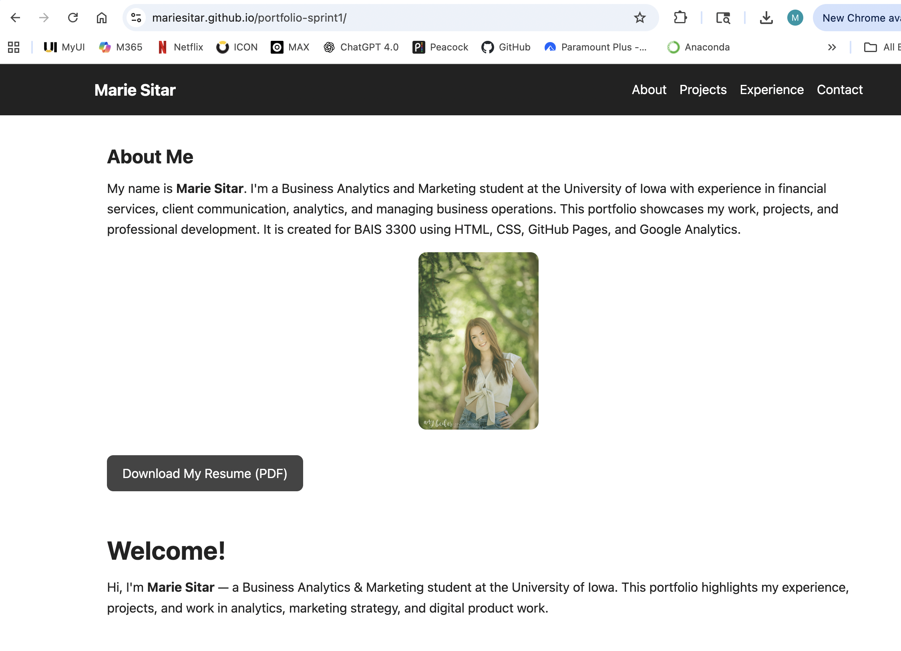

# Portfolio Website (Sprint 1)

## Overview
This repository contains my **personal portfolio website** created during Sprint 1.  
It showcases my background, skills, and project work in a clean, public format.

**Repo:** https://github.com/mariesitar/portfolio-sprint1  
**Live site:** **PASTE YOUR WEBSITE URL HERE**

---

## Purpose
The goal of this project was to:
- build a professional portfolio site
- practice HTML/CSS structure and styling
- publish a live version of the site
- integrate analytics tracking (Google Analytics / GA4)

---

## Features
- Multi-page site (home + policy pages)
- Organized assets (CSS, images, docs)
- Cookie/policy pages included
- Google Analytics tracking (GA4)

---

## Tech Stack
- HTML
- CSS
- JavaScript
- GitHub for version control
- Hosting: **(GitHub Pages / Azure Static Web Apps — fill in what you used)**
- Google Analytics 4 (GA4)

---

## Screenshots



---

## How to Run Locally
1. Download or clone the repo:
   ```bash
   git clone https://github.com/mariesitar/portfolio-sprint1.git

